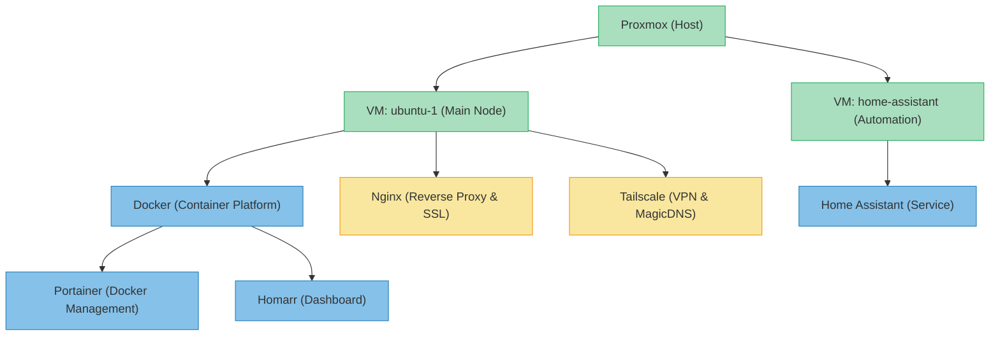
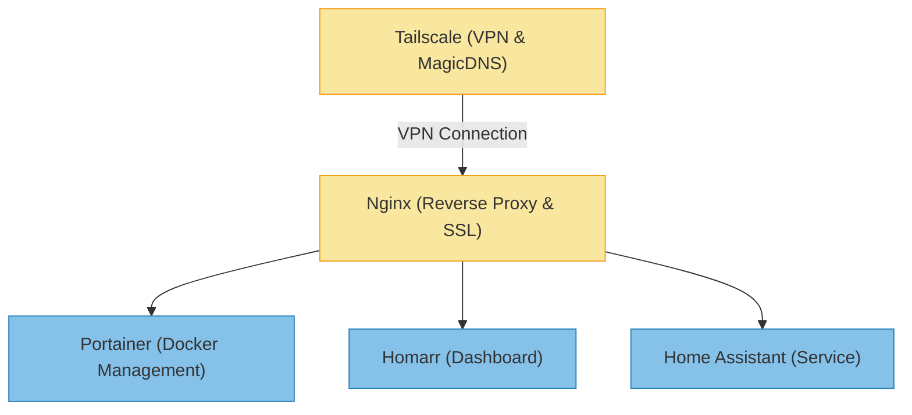

# Home Server Infrastructure

## Overview

* **Physical Server**: Dell Optiplex (with hardware specifications, e.g., CPU, RAM, hard drive)
* **Virtualization System**: Proxmox VE (a Debian-based platform supporting containers and virtual machines)
* **Remote Access**: Restricted to Tailscale network, ensuring private and secure access from anywhere without exposing public ports.
* **Main Domain**: `andresllinasr.com`, with service-specific subdomains managed via CNAME entries pointing to the Tailscale MagicDNS hostname for dynamic access control.

## Architecture Diagrams (Textual Overview)

```plaintext
[ Proxmox (host) ]
     ├── VM: ubuntu-1
     │     ├── Docker
     │     │     ├── Portainer
     │     │     └── Homarr
     │     ├── Nginx (reverse proxy + SSL)
     │     └── Tailscale
     │
     └── VM: home-assistant
           └── Home Assistant
```

## Architecture Diagram in Mermaid



* **Green**: Represents main infrastructure elements, such as Proxmox, ubuntu-1, and home-assistant.
* **Blue**: Denotes services and applications within virtual machines, including Docker, Portainer, Homarr, and Home Assistant.
* **Orange**: Highlights networking and security components like Nginx (reverse proxy & SSL) and Tailscale (VPN & MagicDNS).

## Services Exposure Diagram



## Virtual Machines (VMs)

### ubuntu-1

* **Internal IP**: 192.168.0.104
* **Operative System** Ubuntu Server
* **Purpose**: Main service node
* **Services**:

  * **Docker**:

    * **Portainer**: Web-based Docker container management interface.
    * **Homarr**: Dashboard for centralized service management.
  * **Nginx**: Reverse proxy, handling web traffic and securing communications via SSL/TLS.
  * **Tailscale**: VPN solution based on WireGuard, creating a private network accessible only from authorized devices via MagicDNS.
  * **acme.sh**: A shell script to manage Let's Encrypt SSL certificates. Installs and renews subdomain-specific certificates (e.g., `portainer.andresllinasr.com`, `ha.andresllinasr.com`) using DNS-01 challenge via Porkbun. Automatically reloads Nginx on renewal.
* **Exposed via Nginx**:

  * `/portainer`: Access to Docker management via Portainer.
  * `/`: Redirects to the Homarr interface.
  * `/ha`: Redirects to Home Assistant (on a different VM).
  * `/proxmox`: Access to the Proxmox WebUI (optional, protected).

### home-assistant

* **Internal IP**: 192.168.0.112
* **Operative System** [HAOS](https://developers.home-assistant.io/docs/operating-system/)
* **Purpose**: Dedicated virtual machine for Home Assistant.
* **Access**: Only accessible via Nginx on `ubuntu-1`, secured by HTTPS.

## Domain and Network

* **Domain Provider**: [Porkbun](https://porkbun.com/)
* **DNS**:

  * All service subdomains (e.g., `portainer.andresllinasr.com`, `ha.andresllinasr.com`) are created as **CNAME records** pointing to the MagicDNS domain provided by Tailscale. This allows dynamic IP access via Tailscale's private network.
* **Visibility**: Accessible only by devices within the Tailscale network.

### SSL Certificates

* SSL certificates are generated using Let's Encrypt via `acme.sh` with the DNS-01 method.
* Individual certificates are issued per subdomain rather than a wildcard.
* Certificate files are saved in `/etc/nginx/certs/<subdomain>/`.
* Automatic renewal is handled by `acme.sh`, which reloads Nginx using `systemctl reload nginx`.

## Internal IPs for Each Service

| **Service**        | **Internal IP** | **Port** | **Subdomain**                 |
| ------------------ | --------------- | -------- | ----------------------------- |
| **Proxmox Web UI** | 192.168.0.250   | 8006     | `proxmox.andresllinasr.com`   |
| **Home Assistant** | 192.168.0.112   | 8123     | `ha.andresllinasr.com`        |
| **Portainer**      | 192.168.0.104   | 9000     | `portainer.andresllinasr.com` |
| **Homarr**         | 192.168.0.104   | 7575     | `dashboard.andresllinasr.com` |

## Access and Management

* **SSH**:

  * Access via public key authentication.
  * Root login disabled (recommended).
* **Tailscale**:

  * Virtual private network between devices.
  * Access URL using MagicDNS.
* **Homarr**:

  * Acts as the start dashboard.

## Backups

* TODO

## Pending Tasks / Improvements

* **Example project** Description

## Contact Information

* **Administrator**: Andrés Llinás
* **Email**: [andresllinasr@gmail.com](mailto:andresllinasr@gmail.com)
* **Support**: For assistance, please contact the administrator via email.
